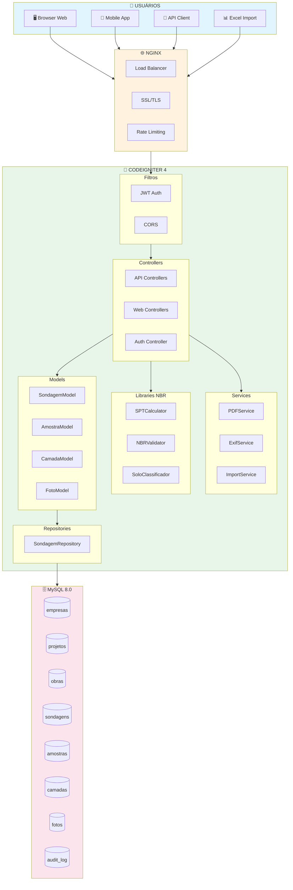
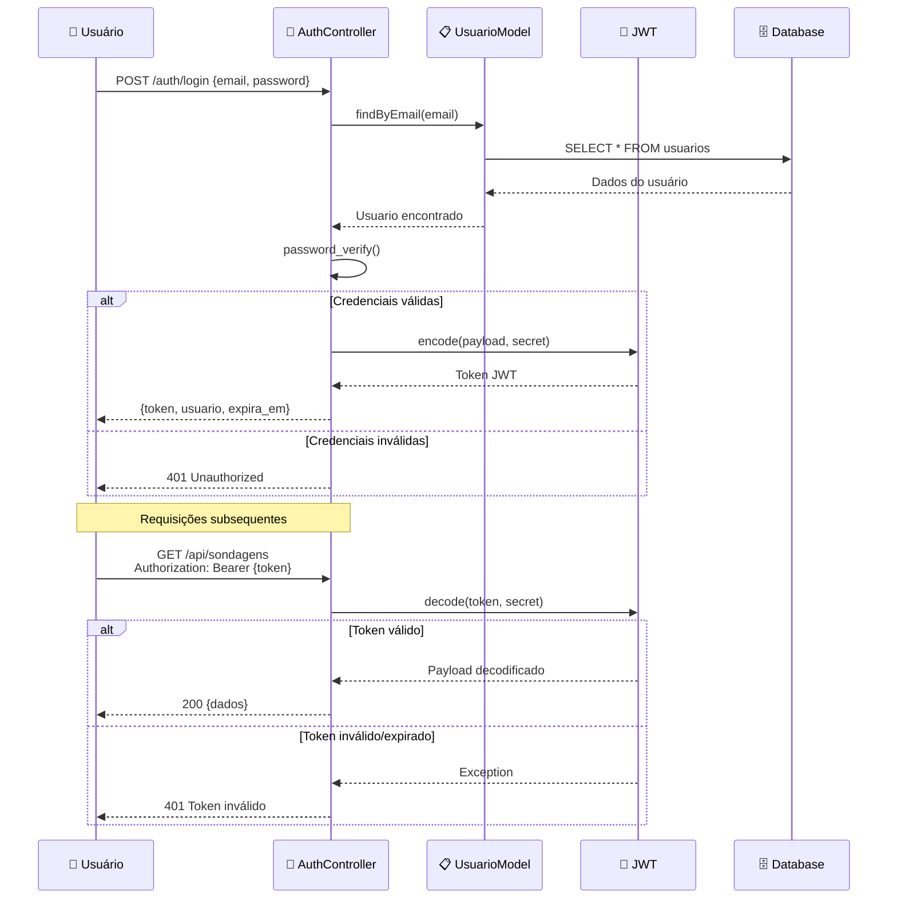
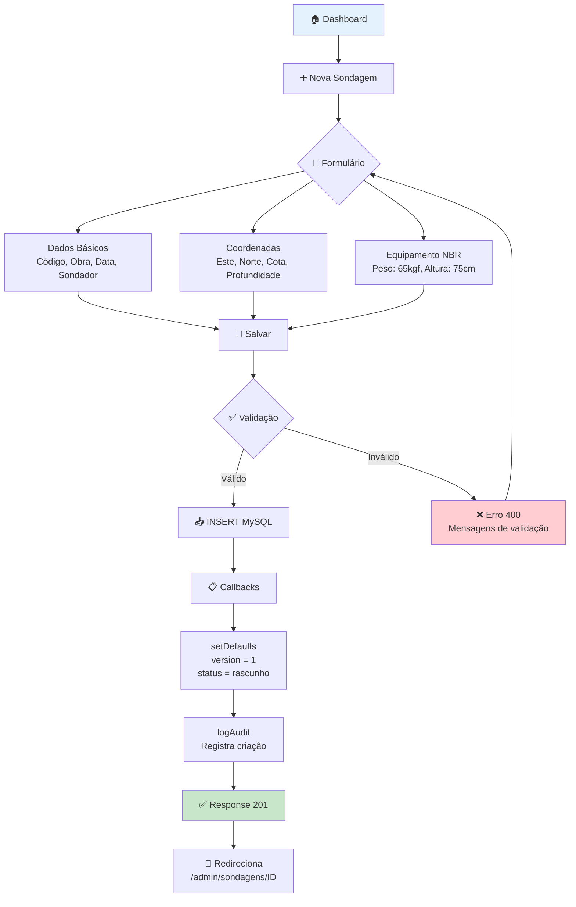
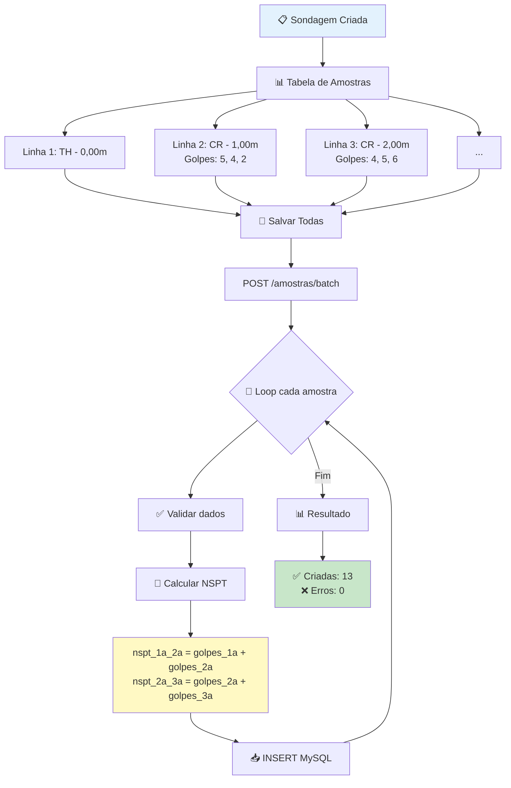
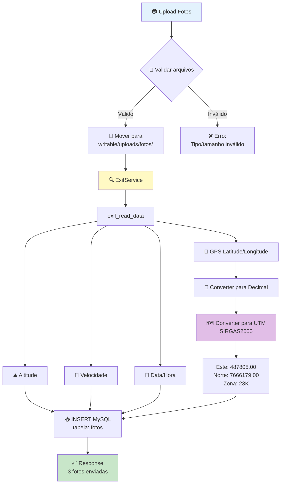
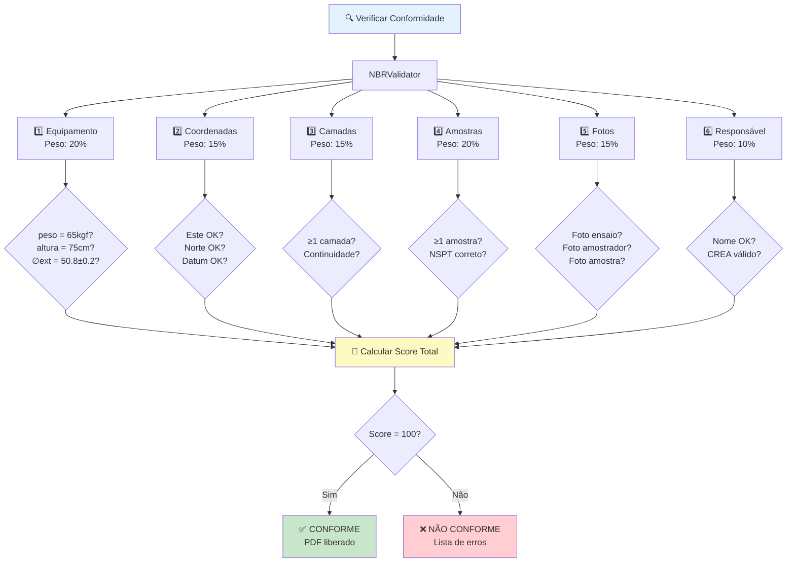
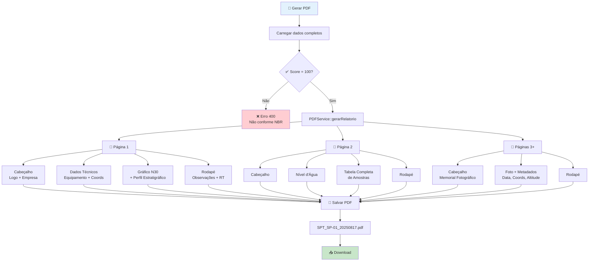
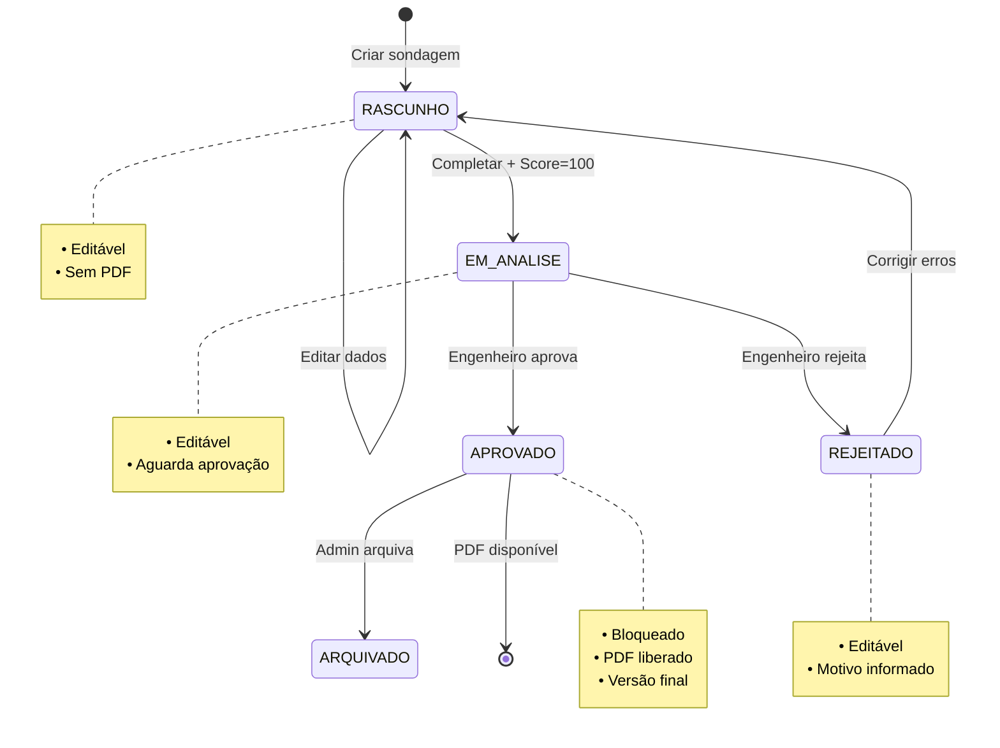
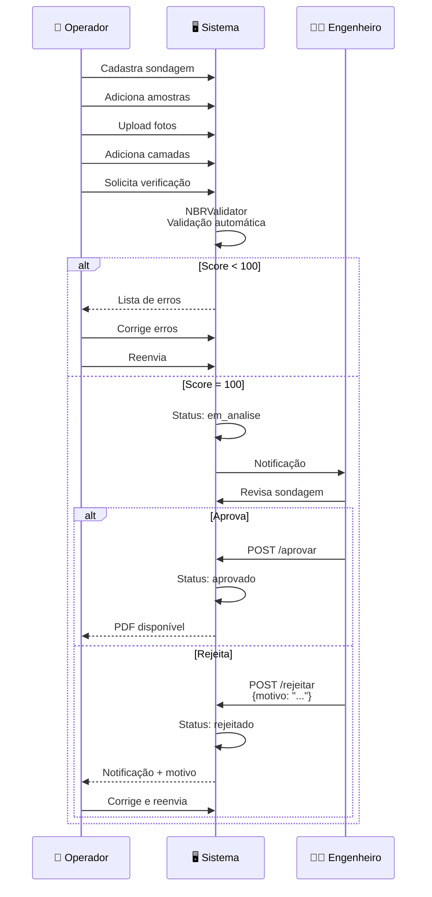
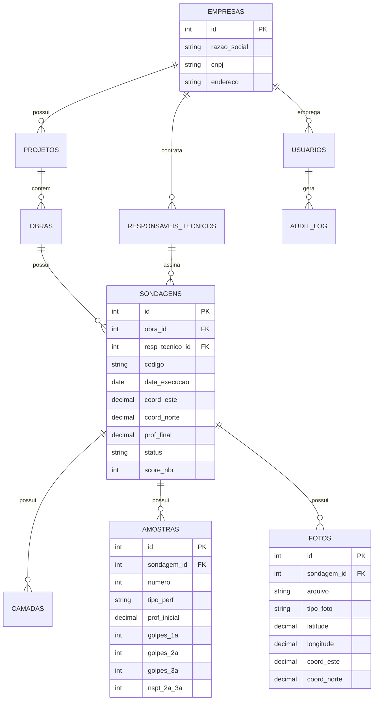

## Fluxograma 1: Visão Geral do Sistema

---

## Fluxograma 2: Autenticação JWT

---

## Fluxograma 3: Cadastro de Sondagem

---

## Fluxograma 4: Cadastro de Amostras SPT

---

## Fluxograma 5: Upload de Fotos com EXIF

---

## Fluxograma 6: Validação NBR 6484:2020

---

## Fluxograma 7: Geração de PDF

---

## Fluxograma 8: Ciclo de Vida da Sondagem

---

## Fluxograma 9: Processo Completo de Aprovação

---

## Fluxograma 10: Diagrama ER Simplificado

---

## Como Visualizar os Diagramas Mermaid

1. **VS Code**: Instale a extensão "Markdown Preview Mermaid Support"
2. **Online**: Cole o código em [mermaid.live](https://mermaid.live)
3. **GitHub**: Os diagramas renderizam automaticamente em arquivos .md
4. **Notion**: Suporta blocos Mermaid nativamente

---

**© 2025 Support Solo Sondagens Ltda**
